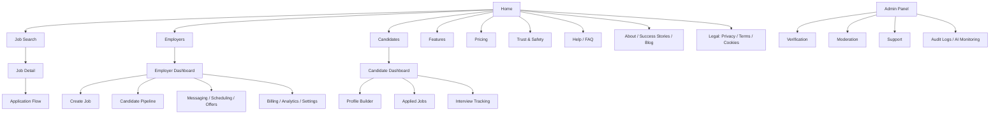
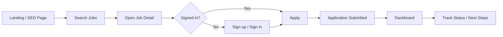

# AbayHire Platform Audit, Gap Analysis, and Redesign Blueprint

## 1. Executive Summary

AbayHire currently behaves like a lightweight job board with basic auth, job posting, job browsing, and application submission. It does not yet function as a full hiring platform comparable to LinkedIn Jobs, Lever, Greenhouse, Workable, Ashby, or Wellfound. The strongest current assets are:

- A Next.js app-router foundation.
- Better Auth integration with email/password login.
- Prisma-backed models for users, jobs, and applications.
- Early role separation between employers and job seekers.
- An employer-verification dependency through SebeVerify.

The biggest gaps are:

- No complete public information architecture.
- No ATS-grade recruiter workflow.
- No candidate profile system.
- No messaging, scheduling, offers, or automation.
- No admin control plane.
- Minimal SEO and structured data.
- Weak trust, compliance, and onboarding surfaces.
- Shallow analytics and no conversion instrumentation.

This redesign treats the research document as the baseline specification for public hiring-site quality and layers in the broader marketplace + ATS architecture required by the brief.

## 2. Current Platform Audit

### 2.1 Existing pages

Current route inventory in `app/`:

- `/`
- `/jobs`
- `/jobs/[id]`
- `/signin`
- `/signup`
- `/dashboard`
- `/employer`
- `/employer/create-job`
- auth/api/config endpoints

This is materially below the page coverage expected for a high-trust hiring platform.

### 2.2 Navigation structure

Before redesign:

- Sparse top nav
- No employer landing page
- No candidate landing page
- No pricing/features/about pages
- No help center
- No trust/legal destinations
- No structured footer navigation

After redesign in this pass:

- Added richer public nav for jobs, employers, candidates, features, pricing, and help.
- Added footer with legal, solution, and company navigation.
- Added a first-pass public IA with core marketing and trust pages.

### 2.3 User flows

Current candidate flow:

1. Land on home
2. Browse jobs
3. Open job detail
4. Sign in/up
5. Apply
6. See application in dashboard

Current recruiter flow:

1. Sign up
2. Verify through SebeVerify dependency
3. Post a job
4. See applicants in a flat list

Key issues:

- No onboarding guidance by role
- No saved jobs, alerts, or profile setup
- No application workflow depth
- No pipeline operations beyond status display
- No interview, offer, or communication flow

### 2.4 UI/UX consistency

Strengths:

- Consistent visual variables and card system
- Cohesive color system
- Clear branding direction

Weaknesses:

- Prototype-level page coverage
- Inconsistent detail depth across screens
- Minimal data density for recruiter workflows
- Thin empty states and guidance
- No information scent for trust/compliance

### 2.5 Recruiter workflow audit

Current capability:

- Post job
- View applicants

Missing:

- Multi-user hiring team workflows
- Candidate stages and bulk actions
- Screening kits
- Interview kits and scorecards
- Scheduling
- Offer pipeline
- Talent pools
- Resume search
- Approval workflow
- Analytics
- Billing and subscriptions

### 2.6 Candidate workflow audit

Current capability:

- Browse jobs
- Apply once
- View application status

Missing:

- Full candidate profile
- Resume parser
- Portfolio/certification/skills sections
- Saved jobs
- Recommendations
- Messaging
- Interview tracking
- Alerts and reminders
- Assessment flows
- Privacy controls

### 2.7 Mobile responsiveness

Current state:

- Core pages are responsive at a basic layout level.
- Navigation and dashboards are not yet optimized for dense mobile hiring workflows.

Needed:

- Mobile-first recruiter tables/pipelines
- Tap-friendly filters
- Multi-step mobile application optimization
- Better text density control and hierarchy

### 2.8 Accessibility

Current status:

- Basic semantic structure present in places
- No dedicated accessibility statement
- No systematic skip links, focus treatments, or tested WCAG coverage

Needed:

- Landmark usage audit
- color contrast verification
- keyboard-first interaction review
- accessible form validation
- accordion and modal semantics

### 2.9 SEO structure

Before redesign:

- Minimal global metadata
- No sitemap/robots
- No structured job markup
- No supporting funnel pages

After redesign in this pass:

- Expanded metadata baseline
- Added `sitemap.ts`
- Added `robots.ts`
- Added JSON-LD `JobPosting` on job detail pages
- Added supporting public pages for topical coverage

### 2.10 Performance

Current notes:

- Lightweight app, so baseline performance is likely acceptable.
- No evidence of instrumentation or budgets.
- No explicit caching/search strategy.

Needed:

- search result caching
- image/content optimization
- Core Web Vitals monitoring
- query profiling
- CDN strategy

### 2.11 Authentication flow

Current state:

- Email/password auth only
- No social login
- No OTP
- No 2FA
- Role selection UI existed but was not reliably persisted before this pass

This pass improved:

- Role persistence after signup
- Role-based action enforcement
- Prevention of employers applying to jobs
- Prevention of job seekers posting jobs

### 2.12 Dashboard usability

Before redesign:

- Candidate dashboard was mostly a list
- Employer dashboard was mostly shortcuts

After redesign in this pass:

- Candidate dashboard now includes summary metrics and recommended roles
- Employer dashboard now includes top-line metrics and pipeline snapshot

Still missing:

- calendar/activity stream
- notifications center
- saved views
- deep workflow actions

### 2.13 Database structure

Current schema is too small for target scope. Existing models:

- `User`
- `Session`
- `Account`
- `Verification`
- `Job`
- `Application`

Major missing domains:

- Company / employer profile
- Team members and permissions
- Candidate profile
- Resume/attachments/documents
- Saved jobs
- Talent pools
- Pipeline stages
- Interview schedules
- Interview feedback
- Offers
- Notifications
- Messaging
- Billing/subscription/invoices
- Moderation/fraud reports
- Audit logs

### 2.14 API architecture

Current architecture:

- Mostly server actions, limited route handlers
- No explicit API versioning
- No public API contract for search, jobs, companies, messaging, admin, or analytics

Needed:

- API-first modular design
- domain-specific service boundaries
- internal/public/admin separation
- webhooks and event layer

### 2.15 Security issues

Observed:

- Role enforcement was incomplete before this pass
- No 2FA
- No suspicious-activity tooling
- No moderation/reporting system
- No explicit audit logging
- No retention/access policy surface

### 2.16 Missing hiring features

Large gaps include ATS, messaging, scheduling, structured application review, offer flows, analytics, and employer branding.

### 2.17 Weak onboarding flows

- No candidate profile completion wizard
- No employer setup wizard
- No guided role-based activation
- No progress measurement

### 2.18 Conversion bottlenecks

- Thin trust signals on job detail
- Limited page depth for SEO landing traffic
- Sparse social proof
- No job alerts or talent community capture
- No saved jobs
- No role-specific acquisition pages

## 3. Gap Analysis

| Existing Feature | Missing Capability | Priority | Recommended Solution | Technical Complexity | Business Impact |
|---|---|---:|---|---:|---:|
| Home page | Trust, product depth, multi-audience messaging | High | Expand into recruiter/candidate/trust narrative with stronger CTA hierarchy | Medium | High |
| Job listings | Search filters, SEO depth, category surfaces | High | Add keyword/location/type filtering now; later add facets, categories, recommendations | Medium | High |
| Job detail | Structured data, compliance blocks, richer trust signals | High | JSON-LD, better info hierarchy, privacy/trust links, saved/share actions later | Medium | High |
| Signup/signin | Role persistence, social login, OTP, 2FA | High | Persist role now; phase social/OTP/2FA into auth service | High | High |
| Employer dashboard | ATS workflow | High | Add metrics snapshot now; phase pipeline, scheduling, offers, collaboration | High | High |
| Candidate dashboard | Profile growth and status clarity | High | Add summary/recommendations now; phase full profile builder and alerts | High | High |
| Prisma schema | Hiring platform entities | High | Introduce company, profile, pipeline, interview, messaging, billing models | High | High |
| Public IA | About/pricing/features/help/legal pages | High | Implement first-pass page set now | Low | High |
| Trust surface | Verification, reporting, moderation UI | High | Add public trust pages now; phase admin workflows and fraud engine | High | High |
| Employer management | Team management and role-based recruiter permissions | High | Add company/team domain and recruiter seats | High | High |
| Candidate tools | Resume parser, skills, portfolio, assessments | High | Add profile domain and parsing pipeline | High | High |
| Communication | In-app messaging, email/SMS, reminders | High | Event-driven notification service + messaging domain | High | High |
| Payments | Plans, featured jobs, invoices | Medium | Billing domain with subscription and transaction models | High | High |
| Analytics | Funnel metrics, source tracking, recruiter analytics | High | Event schema + product analytics + reporting warehouse | Medium | High |
| Admin panel | Moderation, support, audit logs, AI monitoring | High | Dedicated admin app or route group with RBAC and auditability | High | High |
| SEO | Sitemap, robots, blog, structured metadata | High | Added baseline now; phase job category and employer SEO program | Medium | High |
| Accessibility | formal WCAG coverage | High | Add audit checklist, component standards, and test gates | Medium | High |
| Mobile UX | recruiter-grade small-screen operations | Medium | Responsive lists/kanban + optimized forms | Medium | High |

## 4. Target Information Architecture

### 4.1 Public pages

Recommended structure:

- Home
- About
- Pricing
- Features
- Contact
- Careers
- Blog
- Employers
- Candidates
- Success Stories
- Help Center
- FAQ
- Trust & Safety
- Terms
- Privacy
- Cookie Policy

Implemented in this pass:

- Home
- About
- Pricing
- Features
- Contact
- Careers
- Blog
- Employers
- Candidates
- Success Stories
- Help
- FAQ
- Trust & Safety
- Terms
- Privacy
- Cookie Policy

### 4.2 Job discovery

Target:

- Job Search
- Job Categories
- Remote Jobs
- Featured Jobs
- Urgent Hiring
- Internships
- Company Profiles
- Salary Insights
- Recommendations
- Saved Jobs

Implemented now:

- Search page
- Keyword/location/type filters
- SEO-ready job detail

Planned next:

- category routes
- saved jobs
- company profile pages
- recommendations
- salary insights

### 4.3 Candidate portal

Target modules:

- Dashboard
- Profile Builder
- Resume Upload
- Resume Parser
- Skills
- Work Experience
- Education
- Certifications
- Portfolio
- Video Intro
- Saved Jobs
- Applied Jobs
- Interview Tracking
- Notifications
- Messaging
- Assessments
- Career Insights
- Settings

Implemented now:

- Dashboard
- Applied jobs view
- Recommended jobs section

Planned:

- full profile domain and persistence
- resume ingestion pipeline
- candidate messaging/notifications

### 4.4 Employer portal

Target modules:

- Company Dashboard
- Team Management
- Job Posting Wizard
- Candidate Pipeline
- ATS Dashboard
- Interview Scheduling
- Messaging Center
- Offer Management
- Talent Pool
- Resume Search
- AI Candidate Matching
- Analytics
- Billing
- Subscription Management
- Company Branding
- Workflow Settings

Implemented now:

- improved dashboard snapshot
- job management
- create job

Planned:

- pipeline stage management
- workflow settings
- shared hiring team permissions
- analytics and billing

### 4.5 Admin panel

Target modules:

- User Management
- Employer Verification
- Job Moderation
- Fraud Detection
- Analytics
- Revenue Dashboard
- CMS Management
- Support Tickets
- Content Moderation
- Platform Settings
- Audit Logs
- AI Monitoring

Implementation state:

- planned only

## 5. Sitemap

## 6. User Flow Diagrams

### Candidate

### Employer

## 7. Feature Matrix

| Domain | Current | This Pass | Target |
|---|---|---|---|
| Public marketing | Minimal | Expanded | Full brand/content engine |
| Job search | Basic list | Search filters | Faceted, personalized, SEO-scaled |
| Job detail | Minimal | Structured, compliant, SEO-improved | Save/share/company trust/salary insights |
| Candidate dashboard | Basic list | Summary + recommendations | Full profile, interviews, notifications |
| Employer dashboard | Basic shortcuts | Metrics + pipeline summary | ATS-grade workflow center |
| Auth | Email/password | Role persistence + role enforcement | Social login, OTP, 2FA |
| Trust | Verification dependency only | Public trust surfaces | Verification ops + fraud tooling |
| SEO | Weak | Metadata + sitemap + schema | category/company/blog program |
| Admin | None | Planned | Full admin control plane |
| Billing | None | Planned | subscriptions, featured jobs, invoices |

## 8. Database Recommendations

Recommended core entities beyond current schema:

- `Company`
- `CompanyMember`
- `EmployerVerification`
- `CandidateProfile`
- `CandidateDocument`
- `SavedJob`
- `JobCategory`
- `JobSkill`
- `PipelineStage`
- `ApplicationStageEvent`
- `Interview`
- `InterviewParticipant`
- `InterviewFeedback`
- `Offer`
- `MessageThread`
- `Message`
- `Notification`
- `Assessment`
- `AssessmentSubmission`
- `Subscription`
- `Invoice`
- `PaymentTransaction`
- `ModerationReport`
- `FraudSignal`
- `AuditLog`
- `AdminAction`

Design principles:

- Separate user identity from company and candidate profile domains.
- Store timeline events for auditability.
- Keep pipeline stages configurable per company.
- Normalize communication and notifications into event-driven tables.
- Add soft deletion and lifecycle states for moderation-sensitive entities.

## 9. API Architecture Recommendations

### Domains

- Auth
- Candidate
- Employer
- Jobs
- Applications
- Pipeline
- Interviews
- Messaging
- Billing
- Admin
- Analytics

### Style

- Keep server actions for simple internal mutations.
- Add typed route handlers or service-layer endpoints for external/mobile/API-first use.
- Introduce versioned REST or tRPC-style contracts.
- Emit domain events for:
  - application created
  - stage changed
  - interview scheduled
  - offer sent
  - employer verified
  - suspicious activity flagged

## 10. UI/UX Recommendations

- Shift from decorative startup-job-board feel toward operational SaaS clarity.
- Use dense-but-readable layouts for recruiter views.
- Make public pages trust-heavy and conversion-aware.
- Standardize:
  - search bar patterns
  - filter UI
  - badge/status language
  - empty states
  - CTA hierarchy
- Keep mobile flows lightweight, especially for apply and sign-up.

## 11. Component Inventory

Recommended system:

- Global header
- Global footer
- Section heading
- Hero blocks
- Trust badge strip
- Job search bar
- Filter panel
- Job cards
- Company cards
- Candidate profile cards
- Metrics cards
- Pipeline columns
- Candidate list rows
- Messaging thread panel
- Notification toasts/center
- Interview scheduler modal
- Billing table/cards
- Settings forms
- FAQ accordion
- Legal content template

Implemented in this pass:

- richer header
- richer footer
- marketing page template
- job search filters
- improved job card

## 12. Prioritized Implementation Roadmap

### Phase 1: Foundation

- complete IA and content shell
- role enforcement
- SEO baseline
- trust/legal pages
- improved dashboards

### Phase 2: Candidate Experience

- candidate profile builder
- resume upload and parsing
- saved jobs
- alerts
- interview tracking
- messaging

### Phase 3: Employer ATS

- company profiles
- structured posting wizard
- pipelines
- screening/review flows
- interview scheduling
- offer management

### Phase 4: Platform Operations

- admin panel
- moderation
- fraud engine
- support tooling
- billing/subscriptions
- analytics dashboards

### Phase 5: Intelligence and Scale

- AI matching
- AI job descriptions
- AI interview summaries
- recommendation engine
- warehouse/reporting
- API/mobile integrations

## 13. MVP vs Phase 2 Breakdown

### MVP

- auth
- public site
- job discovery
- job detail with schema
- employer posting
- candidate apply
- dashboard status
- verification gate

### Phase 2

- candidate profile
- saved jobs
- messaging
- scheduling
- pipeline stages
- admin moderation
- billing
- blog/content funnel

## 14. Technical Debt Analysis

- Current schema is under-modeled for target scope.
- Role logic was under-enforced.
- UI components were too sparse for scalable workflows.
- README and internal documentation did not match platform ambition.
- No test coverage was added yet for the new role flow/search UX changes in this pass.

## 15. Security Recommendations

- Add 2FA and step-up auth for employers/admins.
- Add email verification and OTP flows.
- Add audit logs for sensitive actions.
- Add report/fraud review queue.
- Add company verification states and restricted feature access.
- Add retention and deletion policies for applicant data.
- Add rate limiting and abuse monitoring on auth/apply/post flows.

## 16. Scalability Recommendations

- Extract search to Postgres FTS first, then Elasticsearch/Algolia if volume grows.
- Introduce queue-based processing for resume parsing, notifications, AI tasks.
- Move analytics events into warehouse-friendly schema.
- Separate marketplace read paths from recruiter operational write paths.
- Add CDN and caching strategy for public pages and job discovery.

## 17. Conversion Optimization Recommendations

- Add saved jobs and job alerts.
- Add employer credibility markers on listings.
- Add company pages and success stories.
- Add localized SEO landing pages by role, city, and category.
- Add lightweight candidate onboarding after signup.
- Add recruiter-specific activation prompts after employer signup.

## 18. What Was Implemented in Code This Pass

- Role persistence after signup
- Role-based enforcement on key server actions
- Searchable jobs page with filters
- Richer home page
- Expanded public information architecture
- Footer and navigation improvements
- SEO metadata baseline
- `sitemap.xml` and `robots.txt`
- JobPosting structured data on job detail pages
- Stronger dashboard summaries for candidates and employers

## 19. Intentional Exclusions in This Pass

These are intentionally planned, not fully implemented, because they require deeper schema and service work than is safe to fake in a UI-only sweep:

- resume parser
- messaging system
- interview scheduling
- offers
- subscriptions/payments
- admin moderation dashboard
- AI matching and AI summaries
- full company profile domain
- saved jobs persistence

Reasoning:

These features require durable data modeling, policy decisions, and operational workflows. They should land with proper domain boundaries rather than as shallow front-end placeholders.
